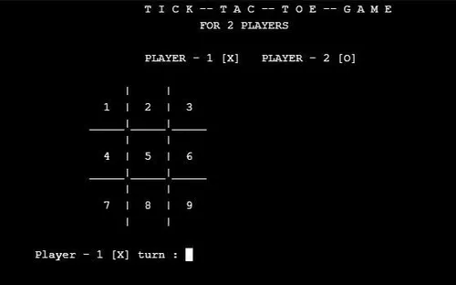

# <p align="center">Builderz &mdash; Tic‑Tac‑Toe (Project 1.0)</p>

<p align="center">
  
</p>

Simple Tic‑Tac‑Toe game made with C++ - Builderz Project 1.0.

**Features:**
- Single-file C++ game (`game.cpp`).
- Terminal UI and two-player local mode.
- Minimal dependencies : just a C++ compiler.

**Build**

Compile with a modern g++:

```bash
g++ game.cpp -O2 -std=c++17 -o game
```

**Run**

```bash
./game
```

**How to play**

- Two players take turns. Follow the on-screen prompts to place X and O.

**Contribute**

Want to add AI, a GUI, or networked play,and more? Fork this repo and  submit a PR.

**Join Builderz?**
 
Telegram : https://t.me/+20bm-nYA7Fc5ODA0

